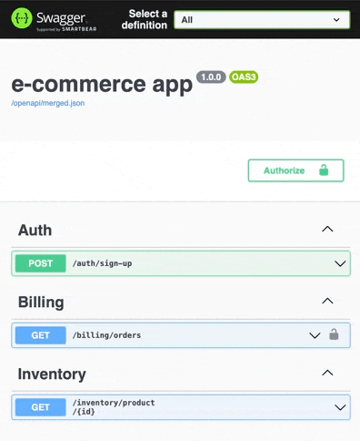

[](https://github.com/graaphscom/compoas/actions/workflows/ci.yml)
[](https://codecov.io/gh/graaphscom/compoas)
[](https://pkg.go.dev/github.com/graaphscom/compoas)

# compoas

Library for building, composing and serving
[OpenAPI Specification](https://github.com/OAI/OpenAPI-Specification)
(aka Swagger).

## Features

This lib provides:

- golang structs which reflect OpenAPI Specification (check "Limitations" below),
- embedded [Swagger UI](https://github.com/swagger-api/swagger-ui) (through `go:embed`) and `http.Handler`
  for serving it,
- functions for merging OpenAPI Specifications and dumping them into a file

## Limitations

- included golang structs not cover entire OpenAPI Specification
- Swagger UI cannot be customized (only setting specification URL is possible)

## Installation

```
go get github.com/graaphscom/compoas
```

## Example code
- [example ecommerce app](internal/docs/ecommerceapp)

## Usage
Let's assume we're building a simple e-commerce app
(same as
in [dbmigrat](https://github.com/graaphscom/dbmigrat/blob/f5506815901304d6fbb107b63c1ed97d64d95025/README.md#usage)).
This app is split into three modules. For now, each module exposes one REST API endpoint:

- auth (provides an endpoint for signing up)
- billing (provides an endpoint for fetching orders list - only for authenticated users)
- inventory (provides an endpoint for fetching a single product)

At the end of this mini-tutorial we will have documentation for each separate module and one merged doc:


That's how our project's directory layout looks like:

```
|-- ecommerceapp
|   |-- auth
|   |   `-- openapi.go
|   |-- billing
|   |   `-- openapi.go
|   |-- cmd
|   |   |-- dump_openapi
|   |   |   `-- main.go
|   |   `-- start_http_server
|   |       |-- main.go
|   |       `-- openapi // this dir contains dumped specs
|   |           |-- auth.json
|   |           |-- billing.json
|   |           |-- inventory.json
|   |           `-- merged.json
|   `-- inventory
|       `-- openapi.go
```

At first, let's define OpenAPI Specification for each module. To save space in this README, I'm pasting spec only for
the billing module.

`billing/openapi.go`:

```go
package billing

import (
	"github.com/graaphscom/compoas"
	"github.com/graaphscom/compoas/internal/docs/ecommerceapp/auth"
	"github.com/graaphscom/compoas/internal/docs/ecommerceapp/inventory"
)

var Openapi = compoas.OAS{
	Openapi: "3.0.0",
	Info: compoas.Info{
		Title:   "Billing API",
		Version: "1.0.0",
	},
	Components: &compoas.Components{
		Schemas: map[string]compoas.Schema{
			"Order": {Type: "object", Properties: map[string]compoas.Schema{
				"id":    {Type: "integer"},
				"buyer": {Ref: "#/components/schemas/User-Read"},
				"items": {Type: "array", Items: &compoas.Schema{Ref: "#/components/schemas/Product"}},
			}},
			"User-Read": auth.Openapi.Components.Schemas["User-Read"],
			"Product":   inventory.Openapi.Components.Schemas["Product"],
		},
		SecuritySchemes: auth.Openapi.Components.SecuritySchemes,
	},
	Paths: map[string]compoas.PathItem{
		"/billing/orders": {
			Get: &compoas.Operation{
				Tags: []string{"Billing"},
				Responses: map[string]compoas.Response{
					"200": {Content: map[string]compoas.MediaType{
						"application/json": {Schema: &compoas.Schema{
							Type:  "array",
							Items: &compoas.Schema{Ref: "#/components/schemas/Order"},
						}},
					}},
				},
				Security: []compoas.SecurityRequirement{{"bearerAuth": {}}},
			},
		},
	},
}
```

`inventory/openapi.go`: [check here](./internal/docs/ecommerceapp/inventory/openapi.go)

`auth/openapi.go`: [check here](./internal/docs/ecommerceapp/auth/openapi.go)

Now it's time to build a command for starting an HTTP server which will be exposing:

- OpenAPI Specifications as JSON files
- Swagger UI

Let's begin creating `cmd/start_http_server/main.go` file:

```go
package main

import (
	"embed"
	"github.com/graaphscom/compoas"
	"log"
	"net/http"
)

//go:embed openapi
var dumpedSpecs embed.FS

func main() {
	oasHandler, err := compoas.UIHandler(
		compoas.SwaggerUIBundleConfig{Urls: []compoas.SwaggerUIBundleUrl{
			{Url: "/openapi/merged.json", Name: "All"},
			{Url: "/openapi/auth.json", Name: "Auth"},
			{Url: "/openapi/billing.json", Name: "Billing"},
			{Url: "/openapi/inventory.json", Name: "Inventory"},
		}},
		"/swagger-ui",
		log.Fatalln,
	)
	if err != nil {
		log.Fatalln(err)
	}

```

Above code configures handler for serving Swagger UI.

The first argument to the `compoas.UIHandler` defines URLs where specifications are available.

We want to have Swagger UI under route `http://localhost:8080/swagger-ui`. For that reason, the second argument to
the `compoas.UIHandler` is `/swagger-ui`.
If Swagger UI should be directly under `http://localhost:8080` we would provide `/` as the second argument.

Now create a handler for static JSON specifications, configure routes and start listening:

```diff
package main

import (
	"embed"
	"github.com/graaphscom/compoas"
	"log"
	"net/http"
)

//go:embed openapi
var dumpedSpecs embed.FS

func main() {
	oasHandler, err := compoas.UIHandler(
		compoas.SwaggerUIBundleConfig{Urls: []compoas.SwaggerUIBundleUrl{
			{Url: "/openapi/merged.json", Name: "All"},
			{Url: "/openapi/auth.json", Name: "Auth"},
			{Url: "/openapi/billing.json", Name: "Billing"},
			{Url: "/openapi/inventory.json", Name: "Inventory"},
		}},
		"/swagger-ui",
		log.Fatalln,
	)
	if err != nil {
		log.Fatalln(err)
	}

+ 	mux := http.NewServeMux()
+ 	mux.Handle("/swagger-ui/", oasHandler)
+ 	mux.Handle("/openapi/", http.FileServer(http.FS(dumpedSpecs)))
+ 
+ 	log.Fatalln(http.ListenAndServe(":8080", mux))
+ }
```

As a final step, we need to prepare command for dumping specifications into JSON files. Let's start
creating `cmd/dump_openapi/main.go` file:

```go
package main

import (
	"github.com/graaphscom/compoas"
	"github.com/graaphscom/compoas/internal/docs/ecommerceapp/auth"
	"github.com/graaphscom/compoas/internal/docs/ecommerceapp/billing"
	"github.com/graaphscom/compoas/internal/docs/ecommerceapp/inventory"
	"log"
	"path"
)

func main() {
	const dir = "cmd/start_http_server/openapi"

	err := auth.Openapi.Dump(true, path.Join(dir, "auth.json"))
	err = billing.Openapi.Dump(true, path.Join(dir, "billing.json"))
	err = inventory.Openapi.Dump(true, path.Join(dir, "inventory.json"))

```

In the code above we're dumping each module's pretty-printed specification. To dump merged specifications we need to
create a new empty specification, the remaining specifications will be merged into it:

```diff
package main

import (
	"github.com/graaphscom/compoas"
	"github.com/graaphscom/compoas/internal/docs/ecommerceapp/auth"
	"github.com/graaphscom/compoas/internal/docs/ecommerceapp/billing"
	"github.com/graaphscom/compoas/internal/docs/ecommerceapp/inventory"
	"log"
	"path"
)

func main() {
	const dir = "cmd/start_http_server/openapi"

	err := auth.Openapi.Dump(true, path.Join(dir, "auth.json"))
	err = billing.Openapi.Dump(true, path.Join(dir, "billing.json"))
	err = inventory.Openapi.Dump(true, path.Join(dir, "inventory.json"))

+ 	rootOpenapi := compoas.OAS{
+ 		Openapi: "3.0.0",
+ 		Info: compoas.Info{
+ 			Title:   "e-commerce app",
+ 			Version: "1.0.0",
+ 		},
+ 		Components: &compoas.Components{
+ 			Schemas:         map[string]compoas.Schema{},
+ 			SecuritySchemes: map[string]compoas.SecurityScheme{},
+ 		},
+ 		Paths: map[string]compoas.PathItem{},
+ 	}
+ 	err = rootOpenapi.Merge(auth.Openapi).
+ 		Merge(billing.Openapi).
+ 		Merge(inventory.Openapi).
+ 		Dump(true, path.Join(dir, "merged.json"))
+ 
+ 	if err != nil {
+ 		log.Fatalln(err)
+ 	}
+ }
```

It's time to start our HTTP server:

1. make sure that directory `cmd/start_http_server/openapi` exists
2. dump specifications - run `go run cmd/dump_openapi/main.go`
3. start server - run `go run cmd/start_http_server/main.go`
4. visit `http://localhost:8080/swagger-ui` in your web browser
